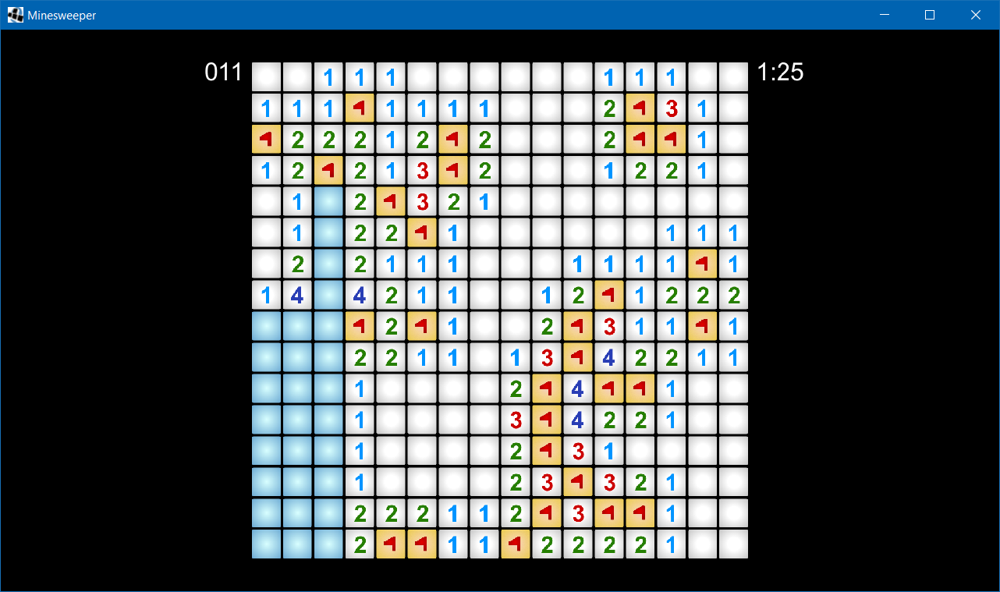

# Minesweeper

### Clone of Minesweeper in libGDX

---

## Description
This is a clone of the Windows Store version of Minesweeper. The gameplay is the same as any other version of Minesweeper, and like the Windows Store version, there is support for zooming and panning the board. Some features are missing, like chording.

The game has only been tested on Windows so far, but as the game was designed using libGDX, it should be compatible with Android and iOS if you implement a way to call the `GameScreen#toggleFlagCell` function on a touchscreen.

### Working with it

It's a libGDX project, so have a look at [the libGDX repository](https://github.com/libgdx/libgdx/) for details on building, debugging, and working with the source code.

### Contributions

Feel free to make a pull request.

### License

This project is licensed under the Apache License, version 2.0.
